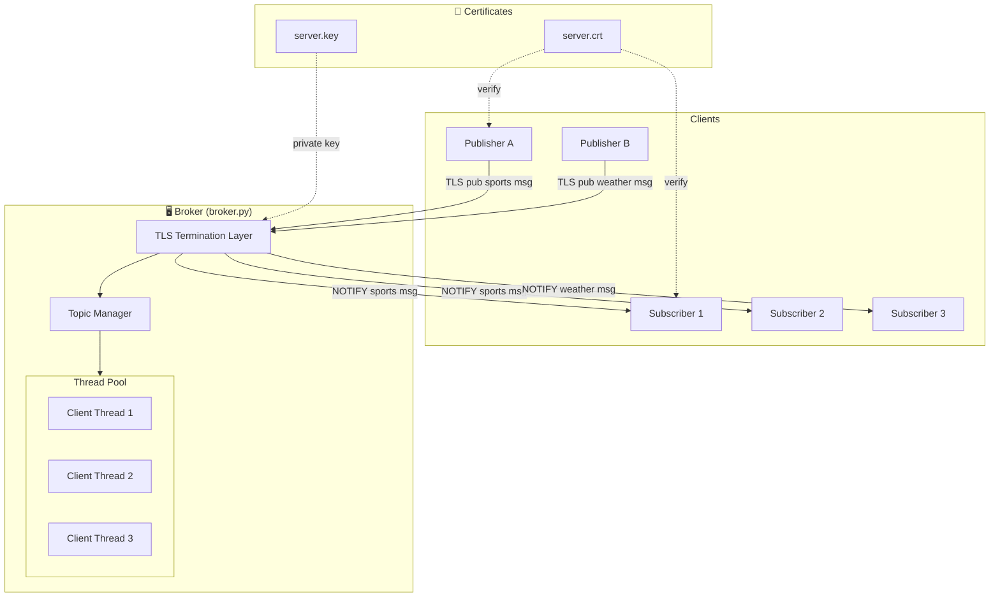
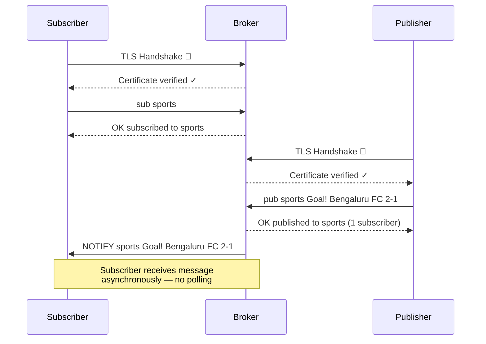
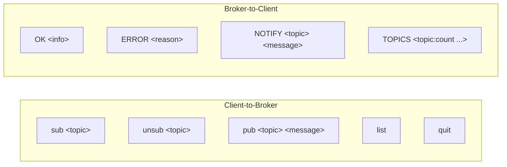
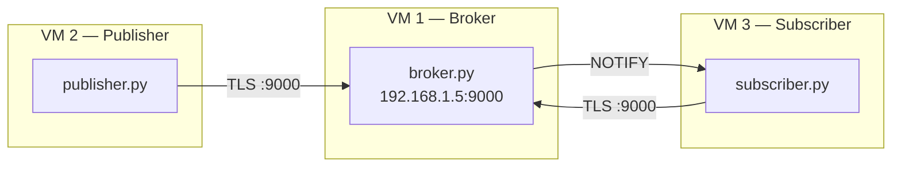

# 🔐 Secure Publish-Subscribe Notification Service

A publish-subscribe message broker built from scratch using **Python TCP sockets with SSL/TLS encryption**. A central broker manages topic subscriptions and delivers messages to all registered subscribers in real time — no polling, no external dependencies.

> **Socket Programming Mini Project — PES University, Bengaluru**

***

## What Problem Does This Solve?

In distributed systems, services often need to communicate without knowing about each other. A publisher generating sports scores shouldn't care *who* is listening, and a subscriber watching for weather alerts shouldn't need to keep asking "is there anything new?"

This project implements the **Publish-Subscribe pattern** — a foundational messaging paradigm where:
- **Publishers** send messages to named *topics*
- **Subscribers** declare interest in *topics*
- A **central broker** routes messages between them — they never talk directly

All communication is encrypted with **TLS 1.2+** to prevent eavesdropping on the wire, making it suitable for multi-device LAN setups (e.g., VMware bridged networking lab environments).

***

## System Architecture



***

## Message Flow (Sequence Diagram)



***

## Project Structure

```
pubsub-project/
├── src/
│   ├── config.py        # Host, port, SSL cert paths (edit for multi-device)
│   ├── broker.py        # Central TLS broker server
│   ├── publisher.py     # TLS publisher client
│   └── subscriber.py    # TLS subscriber client
├── certs/
│   ├── gen_certs.py     # Self-signed certificate generator
│   ├── server.crt       # TLS certificate (generated)
│   └── server.key       # TLS private key (generated, broker only)
├── tests/
│   ├── test_pubsub.py   # Integration tests (12 tests)
│   └── benchmark.py     # Performance evaluation
├── docs/
│   ├── protocol.md      # Wire protocol specification
│   └── architecture.md  # System design & component diagram
├── .gitignore
└── README.md
```

***

## Wire Protocol

All frames are newline-delimited UTF-8 strings over a TLS TCP socket.



| Direction | Frame | Description |
|---|---|---|
| Client → Broker | `sub <topic>` | Subscribe to a topic |
| Client → Broker | `unsub <topic>` | Unsubscribe from a topic |
| Client → Broker | `pub <topic> <message>` | Publish a message to a topic |
| Client → Broker | `list` | Request all active topics + subscriber counts |
| Client → Broker | `quit` | Gracefully disconnect |
| Broker → Client | `OK <info>` | Acknowledgement |
| Broker → Client | `ERROR <reason>` | Error response |
| Broker → Client | `NOTIFY <topic> <message>` | Pushed message (async, no polling) |
| Broker → Client | `TOPICS <topic:count ...>` | Response to `list` |

***

## Requirements

- Python 3.7+ (tested up to 3.12)
- `cryptography` library (one-time, for cert generation only)
- Works on Ubuntu, Windows, and macOS

***

## Setup & Running

### 1. Install dependency (one-time)

```bash
pip install cryptography
```

### 2. Generate SSL certificates (one-time)

```bash
python3 certs/gen_certs.py
```

Creates `certs/server.crt` (shared with clients) and `certs/server.key` (broker only).

***

### Single Machine — 3 Terminals

**Terminal 1 — Start the Broker**
```bash
python3 src/broker.py
```

**Terminal 2 — Start a Subscriber**
```bash
python3 src/subscriber.py
>>> sub sports
>>> sub weather
```

**Terminal 3 — Start a Publisher**
```bash
python3 src/publisher.py
>>> pub sports Goal! Bengaluru FC 2-1
>>> pub weather Heavy rain alert tonight
```

The subscriber in Terminal 2 will instantly receive:
```
NOTIFY sports Goal! Bengaluru FC 2-1
NOTIFY weather Heavy rain alert tonight
```

***

### Multi-Device Setup (LAN / VMware Bridged)



1. Run `ip a` on the broker machine — note its LAN IP (e.g. `192.168.1.5`)
2. Copy `certs/server.crt` to all other machines (same relative path)
3. Edit `src/config.py` on **all machines**:
   ```python
   BROKER_HOST = "192.168.1.5"
   ```
4. On the broker machine, allow the port:
   ```bash
   sudo ufw allow 9000/tcp
   ```
5. Start broker on VM1, then connect from VM2 and VM3

> **VMware note:** Set Network Adapter to **Bridged** mode on all VMs, then run `sudo dhclient` to obtain a LAN IP.

***

## Tests & Benchmarks

### Integration Tests (12 tests)

```bash
python3 tests/test_pubsub.py
# Expected: 12/12 tests passed
```

### Performance Benchmark

```bash
python3 tests/benchmark.py                        # 10 clients, 100 msgs (default)
python3 tests/benchmark.py --clients 20 --messages 200
```

Reports: latency (min / mean / median / stdev), throughput (msg/s), concurrent client delivery rate.

***

## Troubleshooting

| Problem | Fix |
|---|---|
| `ModuleNotFoundError: cryptography` | `pip install cryptography` |
| `SSL certificates not found` | `python3 certs/gen_certs.py` |
| `Connection refused` | Broker not started, or wrong IP in `config.py` |
| `Address already in use` | `lsof -i :9000` then `kill <pid>` |
| Cannot connect across VMs | Set VMware adapter to **Bridged**, run `sudo dhclient` |
| Port blocked | `sudo ufw allow 9000/tcp` on broker machine |

***

## Security Notes

- Uses **TLS 1.2 minimum** — all data on the wire is encrypted
- Certificates are self-signed (suitable for lab/LAN use)
- The private key (`server.key`) never leaves the broker machine
- Clients only need `server.crt` to verify the broker's identity

***

## Docs

- [`docs/protocol.md`](docs/protocol.md) — Full wire protocol specification
- [`docs/architecture.md`](docs/architecture.md) — Component diagram and design decisions
